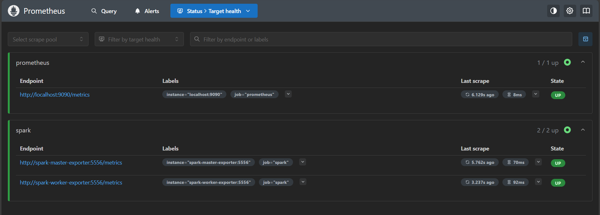

# Weather Data Streaming Pipeline

## 📌 Description
Real-time weather data processing pipeline using Apache Kafka, Spark, and monitoring with Prometheus/Grafana.

## Architecture


## 🧰Technologies Used
- Apache Kafka
- Apache Spark
- Prometheus
- Grafana
- Docker 

## Installation

1. Clone the repository:

```bash
git clone https://github.com/yourusername/Data_streaming.git
```
2.  Navigate to the project directory:

```bash
cd Data_streaming
```
3.  Run Docker Compose:

```bash
docker-compose up -d
```
4. Run Codes:
Start the Kafka weather producer:
```bash
python src/weather_kafka_producer.py
```
 Open a new terminal and start the Spark consumer:
```bash
spark-submit --master spark://localhost:7077 --packages org.apache.spark:spark-sql-kafka-0-10_2.12:3.5.0 src/spark_consumer.py
```
5. 📡 Access Prometheus and monitoring :

open prometheus in your browser :
👉 http://localhost:9090
you should see all the states UP like in this picture : 


6. 📊 Access Grafana for visualizing:

open grafana in your browser:
👉 http://localhost:3000

Default credentials (if configured in docker-compose):
```bash
Username : admin
Password : grafana
```